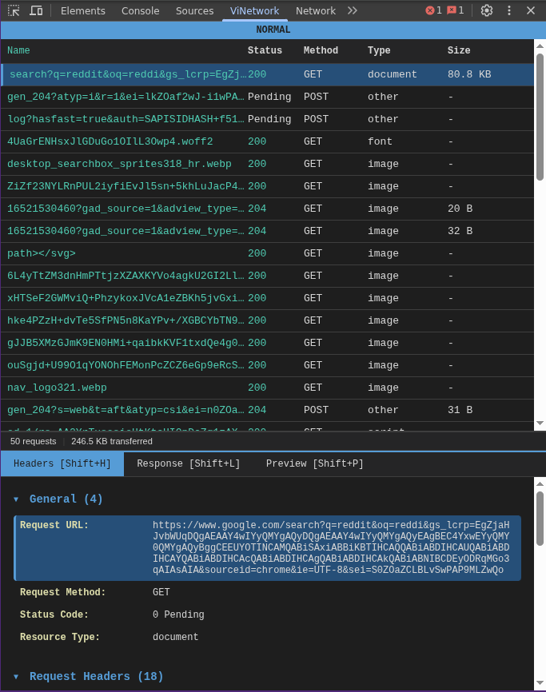
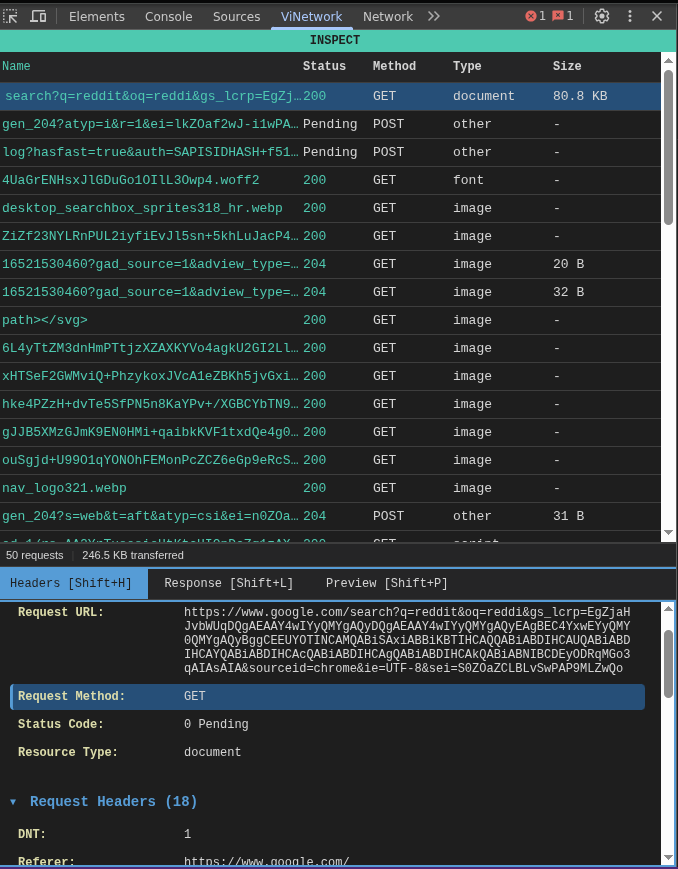
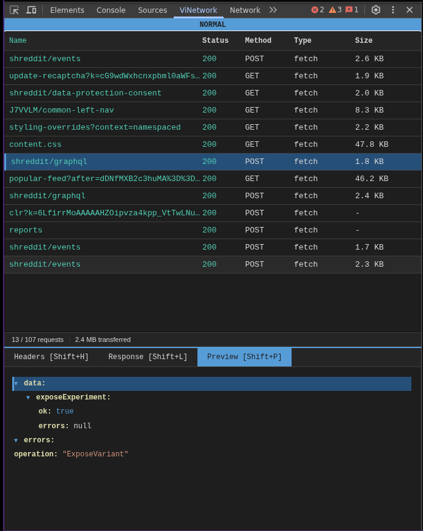
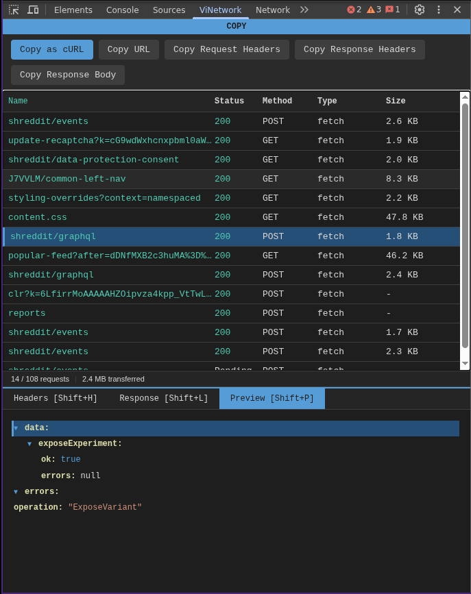

# ViNetwork

A Chrome DevTools extension for monitoring network requests with Vim-style keyboard navigation. Navigate, search, filter, and inspect HTTP requests without touching your mouse.



## Features

- **Vim-Style Navigation** - Use `j/k` to move, `gg/G` to jump, `h/l` to collapse/expand
- **Modal Interface** - Four modes (Normal, Search, Filter, Inspect) like Vim
- **Live Search** - Fuzzy search URLs with `/`
- **Type Filtering** - Filter by XHR, Fetch, JS, CSS, Images, etc.
- **Request Inspector** - View headers, response body, and JSON preview
- **Interactive JSON Viewer** - Collapsible tree with keyboard navigation
- **Copy Utilities** - Copy as cURL, URL, headers, or response body
- **Export** - Save captured requests as JSON or HAR format
- **Color-Coded Status** - Green (2xx), Yellow (3xx), Red (4xx/5xx)

## Screenshots

### Inspect Headers
View request details with expandable sections for General info, Request Headers, and Response Headers.



### JSON Preview
Interactive JSON tree with keyboard navigation. Use `h/l` to collapse/expand nodes.



### Copy Menu
Press `c` to open the copy menu. Copy as cURL, URL, headers, or response body.



## Installation

### From Source

1. **Clone and build:**
   ```bash
   git clone https://github.com/Enigama/ViNetwork.git
   cd ViNetwork
   npm install
   npm run build
   ```

2. **Load in Chrome:**
   - Open `chrome://extensions/`
   - Enable **Developer mode** (toggle in top-right)
   - Click **Load unpacked**
   - Select the `dist/` folder

3. **Use the extension:**
   - Open any website
   - Open DevTools (`F12`)
   - Click the **"ViNetwork"** tab
   - Reload the page to capture requests

## Usage

### Quick Start

1. Open the ViNetwork tab in DevTools
2. Navigate to any website and reload to capture requests
3. Press `j`/`k` to move through requests
4. Press `Enter` to inspect a request
5. Press `Ctrl+?` for help

### Keyboard Shortcuts

#### Normal Mode (default)

| Key | Action |
|-----|--------|
| `j` / `k` | Move down / up |
| `gg` / `G` | Go to first / last request |
| `Enter` | Inspect selected request |
| `/` | Search mode |
| `f` | Filter mode |
| `c` | Copy menu |
| `dd` | Delete selected request |
| `dr` | Clear all requests |
| `Ctrl+s` | Export data |
| `Shift+H/L/P` | Switch tabs (Headers/Response/Preview) |
| `Ctrl+?` | Toggle help |

#### Search Mode

| Key | Action |
|-----|--------|
| *Type* | Search URLs (fuzzy matching) |
| `Enter` | Apply search and return to Normal |
| `q` | Cancel and exit |

#### Filter Mode

| Key | Action |
|-----|--------|
| `h` / `l` | Navigate filter options |
| `Enter` | Toggle selected filter |
| `q` | Exit filter mode |

#### Inspect Mode

When viewing request details:

| Key | Action |
|-----|--------|
| `j` / `k` | Scroll / navigate items |
| `h` / `l` | Collapse / expand sections |
| `gg` / `G` | Jump to top / bottom |
| `Tab` | Cycle through panels |
| `Shift+H/L/P` | Jump to Headers/Response/Preview |
| `z` | Toggle fullscreen |
| `/` | Search within panel |
| `n` / `N` | Next / previous match |
| `y` | Copy (yank) selected item |
| `q` | Return to Normal mode |

## Troubleshooting

### "Failed to attach debugger"

Chrome only allows one debugger per tab. If you see this error:

1. **Close Chrome's Network tab** - Our extension conflicts with it
2. **Try a regular website** - Cannot debug `chrome://` or `file://` pages
3. **Disable conflicting extensions** - React/Vue/Redux DevTools may conflict
4. **Restart Chrome** - Sometimes the debugger state gets stuck

### No requests showing

1. Make sure you're on a regular website (not `chrome://` pages)
2. Reload the page after opening ViNetwork
3. Check the mode indicator shows "NORMAL"

### Keyboard shortcuts not working

1. Click inside the ViNetwork panel to focus it
2. Make sure you're in NORMAL mode (blue indicator)
3. Press `q` to exit any other mode

## Development

```bash
# Install dependencies
npm install

# Development mode (watch for changes)
npm run dev

# Production build
npm run build
```

After making changes, reload the extension in `chrome://extensions/`.

## Browser Compatibility

- **Chrome** 88+ (Manifest V3)
- **Edge** (Chromium-based)

> **Note:** Firefox is not supported due to different DevTools APIs.

## Technical Details

- Built with **Vite** and **TypeScript**
- Uses Chrome **Debugger API** for network interception
- Minimal dependencies (fuse.js for fuzzy search)
- ~21KB bundle size (5KB gzipped)

## Known Limitations

- Cannot monitor `chrome://`, `chrome-extension://`, or `file://` pages
- May conflict with other DevTools extensions using the Debugger API
- Only one instance can run per tab

## License

MIT

---

**Tips:** Press `?` in the extension to see all keyboard shortcuts!
